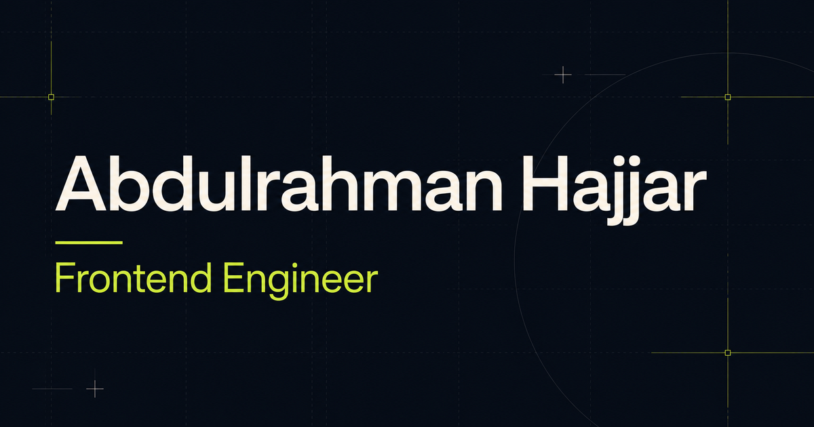

# Abdulrahman Hajjar — Engineering Portfolio



A polished personal portfolio for a **Frontend Engineer with full-stack TypeScript depth**, focused on React, Next.js, accessible product experiences, typed APIs, and production-ready delivery.

**Live site:** [abdulrahman-hajjar-dev.netlify.app](https://abdulrahman-hajjar-dev.netlify.app)  
**GitHub:** [rahman-997](https://github.com/rahman-997)  
**LinkedIn:** [Abdulrahman Hajjar](https://www.linkedin.com/in/abdulrahman-hajjar-5430281a1/)

## What this portfolio demonstrates

- Product-focused frontend engineering with React, Next.js, and TypeScript
- Responsive design systems for mobile, tablet, and desktop
- Accessible interaction states, keyboard navigation, skip links, and reduced-motion support
- Full-stack depth across Express, PostgreSQL, MongoDB, Redis, authentication, and background jobs
- Project case studies with live demos and source links
- Production-minded quality practices: validation, testing, CI/CD, security, observability, and health checks
- Optimized Open Graph and social sharing metadata
- Clean, maintainable Next.js App Router structure

## Featured work

- **FitFlow** — personalized fitness plans, guided intervals, progress tracking, PWA, and offline support
- **Eventify** — event discovery, secure authentication, bookings, waitlists, background jobs, caching, and operational monitoring
- **BookHaven** — full-stack bookstore with catalog, cart, wishlist, checkout, reviews, orders, inventory, and admin tools
- **Venues API** — versioned REST API with validation, layered architecture, predictable errors, persistence, and tests

## Engineering focus

```text
Frontend systems        · React · Next.js · TypeScript · PWA
Backend depth           · Node.js · Express · PostgreSQL · MongoDB · Redis
Product quality         · Accessibility · Performance · Testing · Security
Production delivery     · CI/CD · Observability · Health checks · Deployment
```

## Tech stack

- Next.js 16
- React 19
- TypeScript 5
- Tailwind CSS 4
- Modern CSS with responsive grids, fluid typography, and custom properties
- ESLint and production build validation

## Local development

```bash
git clone https://github.com/rahman-997/portfolio.git
cd portfolio
npm install
npm run dev
```

Open the local address shown in the terminal.

## Quality checks

```bash
npm run lint
npm run build
```

## Netlify deployment

The repository includes a production `netlify.toml` and uses Next.js static export.
Netlify builds the app with `npm run build` and publishes the generated `out/`
directory. Node.js 22.13 is pinned for repeatable builds.

## Project structure

```text
app/
  layout.tsx       metadata and document shell
  page.tsx         portfolio content and project links
  globals.css      design system and responsive layouts
public/
  favicon.svg      custom portfolio icon
  og.png           social sharing card
```

## Accessibility

- Semantic landmarks and heading structure
- Keyboard-visible focus treatment
- Skip-to-content navigation
- High-contrast action states
- Reduced-motion preference support
- Descriptive link and image labels

## Author

Designed and developed by [Abdulrahman Hajjar](https://www.linkedin.com/in/abdulrahman-hajjar-5430281a1/), Frontend Engineer in Istanbul, Türkiye.

## License

Released under the [MIT License](LICENSE).
